# labelme2labelbee(josn)转换脚本
## 一、为何要写这个转换脚本？
### 1.1 labelme
labelme是使用python写的基于QT的跨平台图像标注工具，可用来标注分类、检测、分割、关键点常见的视觉任务，被广大的CV研究者、学生和自由开发者所使用着。
但labelme是基于PyQt编写的，性能有限。labelme在实例分割场景下，当关键点过多时，会出现严重的卡顿，影响标注性能。
Labeme:https://github.com/wkentaro/labelme

### 1.2 labelbee
labelbee是商汤科技开源的计算机视觉领域的 AI 算法框架OpenMMLab团队推出的开源标注工具。
LabelBee标注工具发源于对商业应用场景的一系列算法标注需求，具备拉框、标签、标点、线条、多边形、文本等常用标注工具，可广泛适用于目标检测、分类、分割、关键点、折线、OCR等算法场景。可以JavaScript SDK的方式灵活的“一键”嵌入到业务系统。也可以直接安装开源的客户端版本，解压开箱即用。Labelbee基于JavaScript标注工具，面对更多关键点的实例分割标注问题有更好的性能和更流畅的交互体验，减少了卡顿提高了标注工作效率。
Labelme:https://github.com/open-mmlab/labelbee/
存储结构：

labelme的数据由一个.json文件（名称为：图片名+.json）和图片组成。
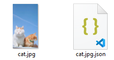
labelbee的数据由一个.json文件（名称为：图片名+后缀+.json）和图片组成。

## 二、如何将labelme的json转为labelbee的json文件?
### 2.1 分析数据结构
labelme和labelbee数据结构组成如下：
labelme的json是一个字典结构，key1:version和key2:flags对于我们的转换并无直接帮助，直接舍弃。
所有的实例分割的多边形以列表的形式储存在shape✔️这个key3对应的值中。列表中每个元素都代表一个多边形，多边形的信息以字典的形式存储在列表中。每个多边形的字典中包裹label、pionts、group_id、shape_type、flags共5个key，对应的值分别代表：label的名称；多边形中的所有关键点的坐标以先x后y的形式存储在一个列表中，来表征一个坐标[x,y]，所有的坐标以标注的顺序存在一个关键点集的列表中；group_id无法映射到labelbee的json中；shape_type用语表述任务类型本脚本用于处理实例分割任务，故都是polygon；flags无法映射到labelbee的json中。
key4:imagePath对应原图的地址
key5:imageData对应原图的地址
key6:imageHeight：图片的高度✔️
key7:imageWidth：图片的宽度✔️
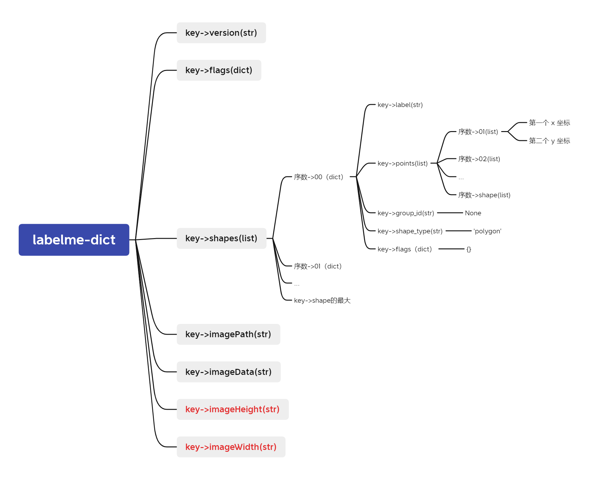
labelbee的json是一个字典结构，key1:width为图片宽度（转换自labelme-imageWidth）✔️和key2:height为图片高度（转换自labelme-imageHeight）✔️
key3:vaild对应一个布尔值初始为True，表示该标签生效（这个在映射过程中硬编码为True，后续可以通过交互修改）。key4:rotate对应旋转角度，一般为0（这个在映射过程中硬编码为0，后续可以通过交互修改）。
key5:step_1对应一个字典，这个字典内部包括dataSourceStep，对应于、toolName对应于任务类型（因为用于实例分割，所以硬编码为："polygonTool"）；result对应的一个列表，不同序数对应于不同的多边形。
id'(str)8位包括大小写字母，也可以包括部分数字，此处根据规则随记生成一串id；sourcelD一般为空，此处硬编码为空；valid对应一个布尔值，该多边形生效为 True，不生效为False，本脚本硬编码为True；textAttribute，一般为空，此处硬编码为空；pointList对应值为多个字典，每个字典有x、y两个键对应的值为关键点的x、y坐标值（转换自labelme-shapes）；attribute，一般为空，此处硬编码为空；order对应的值是顺序，以1开始，此处根据顺序生成数字的序数。
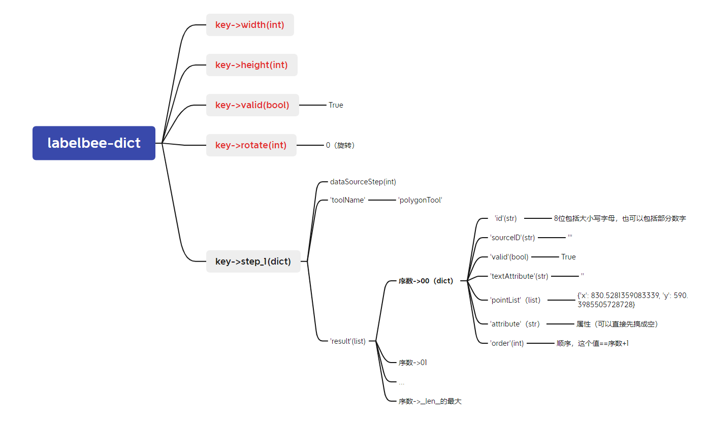
## 三、环境配置&代码实现
### 3.1 环境配置
Python 3.8
labelme 5.0.5
labelbee 0.1.2
### 3.2 代码实现
import json
import random
import string

"""
本代码用于将labelme标注的多边形点的json文件转化为labelbee可以读入的json文件（单步骤的、多边形的），用于搭建其两个不同的软件之间的桥梁.
"""

"""
该函数使用了Python的random.choices方法，它从给定字符集合（包括字母和数字）中随机选择k个字符，
并使用join方法将它们组合成一个字符串。
如果新生成的字符串已经存在于列表中则继续生成新的字符串，直到找到一个没有出现过的字符串。
最后返回生成的字符串列表。
"""
# 定义一个随机生成8位字符串的函数
def generate_strings(num_strings):
    strings = []
    for i in range(num_strings):
        random_string = ''.join(random.choices(string.ascii_letters + string.digits, k=8))#k为字符串长度，即8位
        while random_string in strings:
            # 如果新生成的字符串已经存在于列表中，重新生成一个新的字符串
            random_string = ''.join(random.choices(string.ascii_letters + string.digits, k=8))
        strings.append(random_string)
    return strings
# 输入图片名称
image_name = "cat.jpg"
# 输入labelme文件地址
labelme_route = image_name[0:-4] +".json"

# 打开 JSON 文件并读取数据
with open(labelme_route, 'r') as me:# labelme的
    datame = json.load(me)

# labelme2labelbee->dict
beeout = {}# 这个就是最后转成json，导出的内容
beeout['width'] = datame['imageWidth']
beeout['height'] = datame['imageHeight']
beeout['valid'] = True
beeout['rotate'] = int(0)

# 构造存在labelbee中的step_1的dict，step_1用于表示单步骤。
step_1 = {}
step_1['toolName'] = 'polygonTool'# 此处仅支持多边形

# 每一个序数对应的dict都表示一个标记的封闭图形。
# 提取labelme的信息
meshapes = datame['shapes']# labelme的json中所有的点什么的都在这

result = []# 即step_1中的result(list）
# 生labelbee的id
Bee_id = generate_strings(len(meshapes))

for n_medict in range(0, len(meshapes)):
    # 每循环一次都是一个封闭图形
    medict = meshapes[n_medict]
    mepoints = medict['points']
    result_single = {}
    result_single['id'] = Bee_id[n_medict]# 8位包括大小写字母，也可以包括部分数字
    result_single['sourceID'] = ''
    result_single['valid'] = True
    result_single['textAttribute'] = ''
    # 拆开
    pointList = []# 这个是labelbee的-list
    for n_mepoint in range(0, len(mepoints)):
        beepoint = {}
        mepoint = mepoints[n_mepoint]
        # mex = mepoint[0]
        # mey = mepoint[1]
        beepoint['x'] = mepoint[0]
        beepoint['y'] = mepoint[1]
        pointList.append(beepoint)
    result_single['pointList'] = pointList
    result_single['attribute'] = ''
    result_single['order'] = int(n_medict + 1)
    result.append(result_single)

step_1['result'] = result
beeout['step_1'] = step_1
# 保存
# 将字典保存为JSON文件
# 需要预先在路径下准备一个对应名称的json
with open(image_name + '.json', 'w') as bo:
    json.dump(beeout, bo)
## 四 操作
### 4.1 labelme标注
在cmd输出labelme，启动labelme，点击Open选择一张图片。选择CreatePolygons在图片上点击通过绘制多边形全选目标，并以一种labelname命名这个mask。

保存后，图片路径里面可以看到图片和json文件
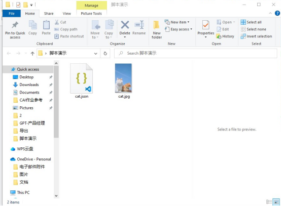
### 4.2 脚本转化
在该路径下创建.py的脚本，粘贴本文脚本进入。

填写image name，运行脚本。
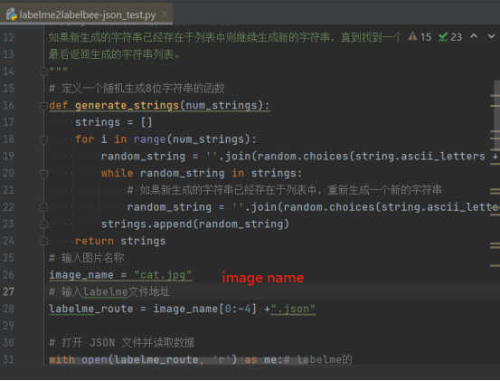
得到一个使用labelbee的json数据文件。
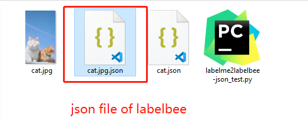
### 4.3 重新将json载入labelbee
进入labelbee，点击New project，创建一个新的标注项目。选择Single Step创建一个单步骤项目。
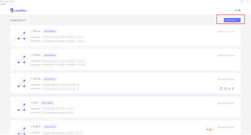
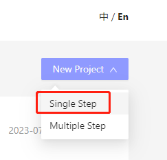
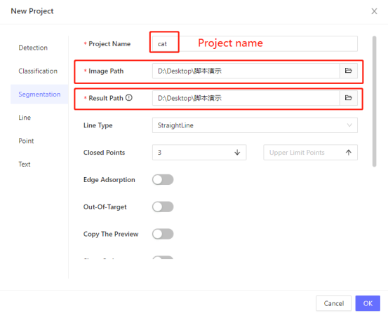
设定开启Attribute，添加多个类型，点击OK创建完成。
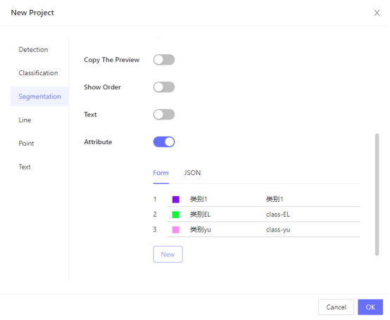
选择新创建的Project。
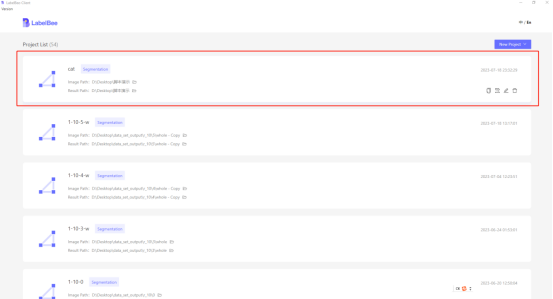

启动之后发现多个多边形已经存在，只是对应的类型未设定。
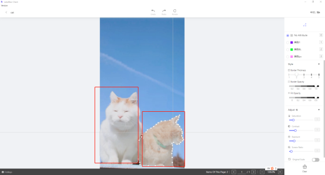
通过右键选中多边形，右侧勾选类型，完成整个数据的转换过程。
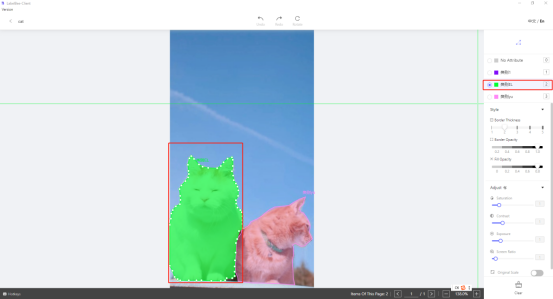
